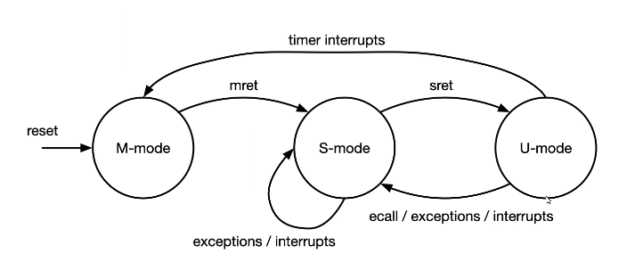

# System Software, Fall 2022

Tokyo Institute of Technology

Lecture Site URL: https://titech-os.github.io/

## Overview

### Directory

```
xv6-riscv/
├── Dockerfile
├── LICENSE
├── Makefile
├── README.md
├── docker-compose.yaml
├── fs.img
├── kernel
├── mkfs
└── user
```

-   `user/`

    User programs, such as `cat`, `echo`, `grep`, `init`, `kill`, `ln`, `ls`, `mkdir`, `rm`, `sh`, `stressfs`, `usertests`, `wc`, `zombie`.

-   `kernel/`

### xv6 cPU mode transition

-   M-mode(= Machine mode)
-   S-mode(= Supervisor mode)
-   U-mode(= User mode)

transition diagram



User process is running in U-mode, and kernel is running in S-mode.

Privileged instructions are not allowed in U-mode. (特権命令はユーザーモードでは許可されていない)

If you turn on the device, the CPU is in M-mode.(reset vector)

(some devices only have M-mode, such as built-in program) (組み込みプログラムなどは、M-modeしかないものもある)

Most interruptions are handled in S-mode. But some interruptions, such as timer interrupts, are handled in M-mode.

I/O interrupts occur U-mode to S-mode interrupts transitions.

### xv6 trap

- initialization

    main関数(osのmain関数)が実行される前に、行う初期化処理について以下では解説する。

## Environment

enter to xv6 environment

1. `docker compose up -d`
2. `docker container exec -it xv6-riscv /bin/bsh`
3. `make`
4. `make qemu`

quit from xv6 environment

1. type `Ctrl + A` and `X`

[Note] xv6 doesn't support `Ctrl + C` to quit.
