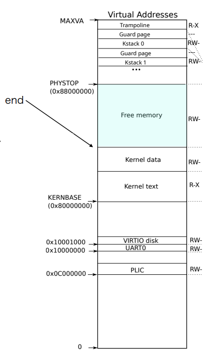

# System Software, Fall 2022

Tokyo Institute of Technology

Lecture Site URL: https://titech-os.github.io/

## Overview

### Directory

```
xv6-riscv/
├── Dockerfile
├── LICENSE
├── Makefile
├── README.md
├── docker-compose.yaml
├── fs.img
├── kernel
├── mkfs
└── user
```

-   `user/`

    User programs, such as `cat`, `echo`, `grep`, `init`, `kill`, `ln`, `ls`, `mkdir`, `rm`, `sh`, `stressfs`, `usertests`, `wc`, `zombie`.

-   `kernel/`

### xv6 cPU mode transition

-   M-mode(= Machine mode)
-   S-mode(= Supervisor mode)
-   U-mode(= User mode)

transition diagram


User process is running in U-mode, and kernel is running in S-mode.

Privileged instructions are not allowed in U-mode. (特権命令はユーザーモードでは許可されていない)

If you turn on the device, the CPU is in M-mode.(reset vector)

(some devices only have M-mode, such as built-in program) (組み込みプログラムなどは、M-mode しかないものもある)

Most interruptions are handled in S-mode. But some interruptions, such as timer interrupts, are handled in M-mode.

I/O interrupts occur U-mode to S-mode interrupts transitions.

### xv6 trap

-   initialization

    main 関数(os の main 関数)が実行される前に、行う初期化処理について以下では解説する。

    [kernel/start.c](/kernel/start.c)

    ```c
    ...
    // entry.S jumps here in machine mode on stack0.
    void
    start()                                                                 <-- 起動時は M-mode
    {
    // set M Previous Privilege mode to Supervisor, for mret.
    unsigned long x = r_mstatus();
    x &= ~MSTATUS_MPP_MASK;                                                 <-- mret 実行時に S-mode に遷移するように設定(上図参照)
    x |= MSTATUS_MPP_S;
    w_mstatus(x);

    // set M Exception Program Counter to main, for mret.
    // requires gcc -mcmodel=medany
    w_mepc((uint64)main);                                                   <-- mret 実行時に main 関数に遷移するように設定

    // disable paging for now.
    w_satp(0);

    // delegate all interrupts and exceptions to supervisor mode.
    w_medeleg(0xffff);                                                      <-- 割り込みと例外を S-mode で処理するように設定(mode遷移を行えるようにするための設定)
    w_mideleg(0xffff);
    w_sie(r_sie() | SIE_SEIE | SIE_STIE | SIE_SSIE);
    ...
    ```

-   CSR (Control/ Status Register)

CPU の動作状態を参照、設定する特殊レジスタ

    - M-mode CSR
        - mstatus: M-mode machine status
        - mepc: M-mode exception program counter(M-modeへの遷移が生じた際のProgram Counter)
        - medeleg/ mideleg: exceptions, interrupts delegation (例外、割り込みの移譲を設定)
        ...

-   trap vector

トラップ発生時の制御の移動先(アドレス)

    - mtvec: M-modeに遷移するトラップ用
    - stvec: S-modeに遷移するトラップ用(U -> S, S -> S)

## Environment

enter to xv6 environment

1. `docker compose up -d`
2. `docker container exec -it xv6-riscv /bin/bsh`
3. `make`
4. `make qemu`

quit from xv6 environment

1. type `Ctrl + A` and `X`

[Note] xv6 doesn't support `Ctrl + C` to quit.

run user tests

1. `usertests` (after `make qemu`)

## How to add new command

### user command

### system call

-   [`kalloc(void)`](kernel/kalloc.c)

    Line: 51

    ```c
    if(((uint64)pa % PGSIZE) != 0 || (char*)pa < end || (uint64)pa >= PHYSTOP)
    panic("kfree");
    ```

    `(uint64)pa % PGSIZE) != 0` means pa(= page address) is not aligned to PGSIZE(= page size).

    `(char*)pa < end` means pa is not in the kernel memory.(kernel memory is from `end` to `PHYSTOP`)

    `(uint64)pa >= PHYSTOP` means pa is not in the kernel memory.(kernel memory is from `end` to `PHYSTOP`)

    

    [Note] `end` is defined in [kernel/entry.S](kernel/entry.S)

    Line 55

    ```c
    memset((char*)pa, 1, n);
    ```

    `memset` is defined in [kernel/string.c](kernel/string.c)

    argument 1: `void*` is the address of the memory to be set.
    argument 2: `int` is the value to be set.
    argument 3: `uint` is the number of bytes to be set.

    Line 59 - 62

    ```c
    acquire(&kmem.lock);
    r->next = kmem.freelist;
    kmem.freelist = r;
    release(&kmem.lock);
    ```

    `acquire` is defined in [kernel/spinlock.c](kernel/spinlock.c)
    r->next = kmem.freelist; means r->next is the next free page.

    `kmem.freelist` is the head of the free page list.
    address which pa points is now free. So, we add it to the free page list.

    `kmem.freelist = r;` means the above explanation.
